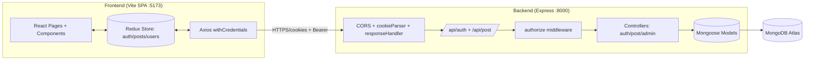
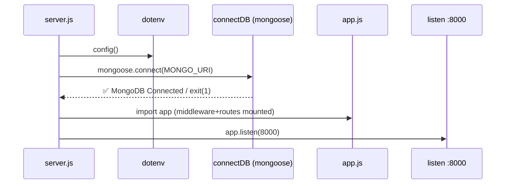
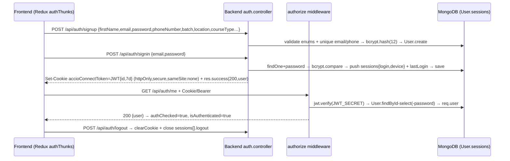

# Accio Connect — Project Architecture

> Monorepo: `frontend/` (React 19 + Vite 7 + Redux Toolkit + Tailwind 4) +
> `backend/` (Node 18+ + Express 5 + Mongoose 9 + JWT + bcryptjs + MongoDB).
> Repo: `https://github.com/sai4u-dev/accio-connect`
> Generated from a full read of `backend/src/**` and `frontend/src/**`.

## 1. System Overview

Accio Connect is a full-stack job + networking platform for learners
(batches, courses, centres), instructors, and placed alumni. Users sign up with
batch/course/location, sign in via JWT cookie, create text/image/video posts,
like/comment, browse users, and view profiles with session history.



Deployment today: frontend → Vercel (`vercel.json` SPA rewrite to
`index.html`); backend → Node host on port `8000`; CORS allowlist =
`http://localhost:5173` + 2 Vercel origins. See `backend/src/app.js:8-22`.

Standalone diagram sources: [`architecture.mmd`](./architecture.mmd)
(render with Mermaid Live / `mmdc`).

## 2. Repository Map

```text
accio-connect/
├── backend/
│   ├── package.json            # accio-connect-server@1.0.0, type: commonjs
│   └── src/
│       ├── server.js           # entry: dotenv → connectDB → app.listen(8000)
│       ├── app.js              # cors, express.json, cookieParser,
│       │                       # responseHandler, /api/auth, /api/post,
│       │                       # /healthcheck, /admin, /, /test, 404, errorHandler
│       ├── config/db.js        # mongoose.connect(process.env.MONGO_URI)
│       ├── constants.js        # ALL_BATCH, LOCATION, COURSE_TYPE (frozen)
│       ├── routes/
│       │   ├── auth.routes.js  # signup, signin, logout, profile, me, getallusers
│       │   └── post.routes.js  # CRUD + like + comment + by-user + single
│       ├── controllers/
│       │   ├── auth.controller.js  # signup/signin/logout/profile/me/getAllUsers
│       │   ├── post.controller.js  # 8 post handlers
│       │   └── admin.controller.js # getAllLogs (reads src/logs/hai.txt)
│       ├── middleware/
│       │   ├── auth.middleware.js  # cookie `accioConnectToken` or Bearer → req.user
│       │   └── error.middleware.js # {success:false, message, stack?}
│       ├── models/             # ONLY User + Post are wired (see §6)
│       │   ├── user.model.js / userSchema.js / post.model.js
│       │   └── connection / conversation / message /
│       │       notification / placement / referral (.model.js)
│       └── utils/response.js   # res.success / res.err envelope
└── frontend/
    ├── package.json            # accio-connect-frontend, type: module
    ├── vite.config.js          # react() + tailwindcss(), base "/"
    ├── vercel.json             # SPA fallback rewrites → /index.html
    ├── index.html              # #root + /src/main.jsx
    └── src/
        ├── main.jsx            # Provider(store) → App
        ├── App.jsx             # checkMe() gate → BrowserRouter Routes
        ├── app/store.js        # {auth, posts, users}
        ├── features/
        │   ├── auth/{authSlice,authAPI,authThunks}.js
        │   ├── posts/{postSlice,postAPI,postThunks}.js
        │   └── users/{userSlice,userApi,userThunks}.js
        ├── routes/{ProtectedRoute,PublicRoute}.jsx
        ├── pages/{Dashboard,Profile,Users,SignIn,SignUp}.jsx
        ├── components/         # Navbar, Sidebar(AsideBar), PostCard,
        │                       # CreatePostModal, SearchBar , RecentlyPlaced,
        │                       # AsideBar, HoverPopover/HoverCard, UserDashboard…
        └── utils/{axios,timeAgo,motion}.js
```

## 3. Runtime Flows

### 3.1 Backend startup (`backend/src/server.js` + `config/db.js`)



Note: port is hardcoded (`8000`), `process.env.PORT` is ignored.

### 3.2 Request pipeline (`backend/src/app.js`)

1. `cors({origin: [vercel×2, localhost:5173], credentials: true, …})`
2. `express.json()` → 3. `cookieParser()` → 4. `responseHandler`
   (adds `res.success(status,message,data)` / `res.err(...)`)
5. Routers `/api/auth`, `/api/post`; misc `GET /healthcheck`, `/admin`,
   `/`, `/test`; catch-all `404 {success:false,"Route not found"}`; finally
   `errorHandler`.

### 3.3 Auth flow (JWT cookie)



Token source priority: `req.cookies.accioConnectToken` →
`Authorization: Bearer <token>`. Failures return `401` via `res.err`.

### 3.4 Post flow

`CreatePostModal` → `dispatch(createPost({contentType,content,caption,type:"post",
isLikeDisable,isCommentDisable}))` → `POST /api/post` (`authorize`) →
`Post.create({user: req.user.id, …})` + `populate(user: firstName lastName
profilePicture)` → `posts.unshift(payload)`.
`PostCard` → `toggleLike(postId)` (`PUT /api/post/:postId/like`) and
`addComment({postId,comment})` (`POST /api/post/:postId/comment`) →
optimistic slice update of `likes[]` / `comments[]` (denormalized snapshots
`{userId:String, userName, profilePic, comment?, createdAt?}`).

## 4. Backend API Reference (Wired Today)

Base: `http://localhost:8000`. Frontend base: `VITE_BACKEND_API_URL=http://localhost:8000/api`.

### Auth (`backend/src/routes/auth.routes.js`, prefix `/api/auth`)

| Method | Path | Auth | Controller | Notes |
| ------ | ---- | ---- | ---------- | ----- |
| POST | `/api/auth/signup` | public | `signup` | Validates batch/location/courseType; 409 on dup email/phone; bcrypt-12 |
| POST | `/api/auth/signin` | public | `signin` | `+password` select; pushes `sessions[]`; sets 7d cookie |
| POST | `/api/auth/logout` | **missing** (bug) | `logout` | Expects `req.user` but no middleware; `clearCookie` flags mismatch signin |
| GET | `/api/auth/profile` | `auth` | `profile` | `findById(req.user.id).select(-password)` |
| GET | `/api/auth/me` | `auth` | `me` | Returns `req.user`; drives `checkMe()` session restore |
| USE | `/api/auth/getallusers` | `auth` | `getAllUsers` | `router.use` matches all verbs (should be `GET`); no pagination; raw `res.json` |

`updateProfile` is exported but **no route wires it** (frontend `updateProfile`
thunk therefore always performs a `GET` — dead update path).

### Posts (`backend/src/routes/post.routes.js`, prefix `/api/post`)

| Method | Path | Auth | Controller |
| ------ | ---- | ---- | ---------- |
| POST | `/api/post/` | `authorize` | `createPost` (requires `contentType,content,type`) |
| PUT | `/api/post/:postId` | `authorize` | `updatePost` (owner-only) |
| DELETE | `/api/post/:postId` | `authorize` | `deletePost` (owner-only) |
| GET | `/api/post/` | **public** (`//should be authorize`) | `getAllPosts` (populated, newest first, no pagination) |
| POST | `/api/post/:postId/comment` | `authorize` | `postComment` (400 empty, 403 if `isCommentDisable`) |
| PUT | `/api/post/:postId/like` | `authorize` | `likeUnlikePost` (toggle; 403 if `isLikeDisable`) |
| GET | `/api/post/user/:userId` | `authorize` | `getAllPostByUserId` (populate fields mismatch — see §7) |
| GET | `/api/post/:postId` | `authorize` | `getSinglePost` (no populate) |

Route order is safe: `/user/:userId` is registered before `/:postId`.

### Misc (`backend/src/app.js`)

| Method | Path | Auth | Behavior |
| ------ | ---- | ---- | -------- |
| GET | `/healthcheck` | no | `200 {message:"Hello from middleware"}` |
| GET | `/admin` | **no (bug)** | `getAllLogs` — async `fs.readFile` race, always stale first call |
| GET | `/` | no | `<h1>Accio Connect</h1>` |
| GET | `/test` | no | `Hello` |

## 5. Frontend Architecture

### 5.1 Boot + routing (`main.jsx`, `App.jsx`)

`main.jsx: Provider(store) → App`. `App.jsx` dispatches `checkMe()` on mount,
renders `Checking session…` until `authChecked`, then:

| Path | Guard | Page |
| ---- | ----- | ---- |
| `/login` | `PublicRoute` (authed → `/`) | `SignIn.jsx` (email+password) |
| `/signup` | `PublicRoute` | `SignUp.jsx` (name, email, password+strength, phone, avatar URL, batch `OBH_1/2/3`, course `mern/java/da`, location 5 centres) |
| `/` | `ProtectedRoute` | `Dashboard.jsx` (SearchBar + Sidebar + PostCard feed + RecentlyPlaced + UserDashboard) |
| `/users` | `ProtectedRoute` | `Users.jsx` (SearchBar + UserProfiles + FloatingSearchButton) |
| `/profile` | `ProtectedRoute` | `Profile.jsx` (avatar, stats, info, sessions table, edit modal → `updateProfile`, logout) |

No `*` 404 route. Sidebar links `/rp` (Referral) and `/connetions` (typo,
Connections) are **dead** — no matching `<Route>`.

### 5.2 Redux store (`src/app/store.js`)

```text
{ auth: {user, isAuthenticated, loading, authChecked, error},
  posts: {posts[], loading, error},
  users: {users[], loading, error} }
```

| Slice | Thunks → API | Reducer effect |
| ----- | ------------ | -------------- |
| auth | `signup→POST /auth/signup`, `signin→POST /auth/signin`, `checkMe→GET /auth/me`, `fetchProfile→GET /auth/profile` (no reducer — dead), `updateProfile→GET /auth/profile` (bug: ignores PUT/FormData), `logout→POST /auth/logout` | `user/isAuthenticated/loading/authChecked/error`; all unwrap `res.data.data` |
| posts | `fetchPosts→GET /post`, `createPost→POST /post`, `toggleLike→PUT /post/:id/like`, `addComment→POST /post/:id/comment` | `fetchPosts` replaces; `createPost` unshifts; like/comment patch matching `_id` |
| users | `fetchUsers→GET /auth/getallusers` | replaces `users[]` |

Three separate `axios.create({baseURL: VITE_BACKEND_API_URL,
withCredentials: true})` instances exist (`utils/axios.js`, `postAPI.js`,
`userApi.js`) — consolidation candidate.

### 5.3 Component tree (rendered)

```text
main.jsx Provider
└─ App BrowserRouter
   ├─ PublicRoute → SignIn / SignUp
   ├─ ProtectedRoute → Dashboard
   │  ├─ SearchBar (isVisible, searchTerm, setSearchTerm)  # file has trailing space: "SearchBar .jsx"
   │  ├─ Sidebar (default export AsideBar) → CreatePostModal (isOpen, onClose)
   │  ├─ PostCard[] (post) → HoverPopover likes/comments + comment form
   │  └─ RecentlyPlaced(users[0..5]) + UserDashboard(hardcoded Admin/Blocked)
   ├─ ProtectedRoute → Users → SearchBar + UserProfiles(filtered) + FloatingSearchButton
   └─ ProtectedRoute → Profile → glass-cards + sessions table + edit modal (FormData) + logout
```

Unused/dead UI: `Navbar.jsx` (never rendered), `AsideBar.jsx` (imports
nonexistent `pages/Feed`), `HoverCard.jsx`, `Sleleton.jsx` (typo),
`UserDashboard.jsx` hardcoded data.

## 6. Backend Layering

* **Config:** `config/db.js` — single `mongoose.connect(MONGO_URI)`, no options.
* **Middleware:** `auth.middleware.js` (cookie-or-Bearer → `req.user`),
  `error.middleware.js` (envelope + conditional stack).
* **Utils:** `response.js` — uniform `{success, message, data/details}`.
* **Controllers:** input validation → Mongoose ops → `res.success` / `next(err)`.
* **Models:** only `User` (`user.model.js`) and `Post` (`post.model.js`) are
  imported. `userSchema.js` (enterprise design: roles, MFA, OAuth, soft-delete)
  is **unexported dead code**. `connection/conversation/message/notification/
  placement/referral` models are **planned but unloadable** (missing
  `require("mongoose")` → `ReferenceError` on import). Full field tables:
  [`DATABASE_DESIGN.md`](./DATABASE_DESIGN.md).

## 7. Known Tech Debt (Fix Before Scaling)

1. Add `require("mongoose")` to 6 planned models; add import smoke test.
2. Decide fate of `userSchema.js` (merge roles/MFA/soft-delete into
   `user.model.js` or delete) — currently confusing duplicate.
3. Protect `GET /admin`, fix `readFile` async race, move logs out of `src/`.
4. Add `auth` to `logout`, align `clearCookie` flags with signin cookie.
5. `router.use("/getallusers")` → `router.get` + pagination + projection.
6. Paginate `GET /api/post/`; fix `getAllPostByUserId` populate
   (`firstName profilePicture`, not `userName profilePic`).
7. Fix `Date.now()` → `Date.now` default in `post.model.js` comments;
   change `likes.userId`/`comments.userId` from `String` to `ObjectId ref`.
8. Wire `updateProfile` route (+ upload middleware) or remove the thunk.
9. Consolidate Axios instances; add `*` 404 route; fix `/rp`, `/connetions`.
10. Add `helmet`, `express-rate-limit`, env-driven `PORT` + cookie `secure` flag.
11. Delete `user.txt`-style credential fixtures; add `.env.example` files.

## 8. Environments & Deployment

| Env | Frontend | Backend | DB |
| --- | -------- | ------- | -- |
| Local | `vite` :5173 | `nodemon src/server.js` :8000 | Atlas/local via `MONGO_URI` |
| Prod (current) | Vercel (SPA rewrite) | Node host :8000 | Atlas |

Required env: backend `MONGO_URI`, `JWT_SECRET`; frontend `VITE_BACKEND_API_URL`.
`.env` files are gitignored — never commit them.
