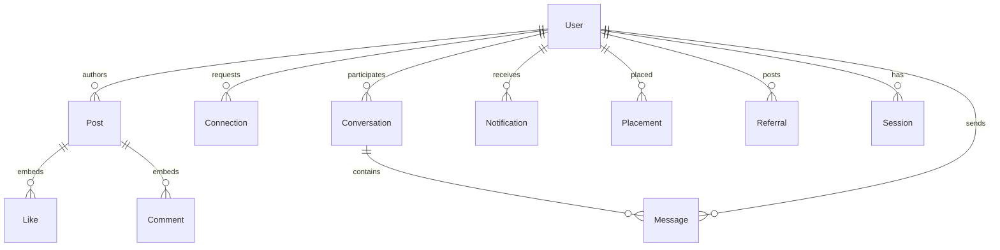

# Accio Connect — Database Design & Data Modeling

> ODM: **Mongoose 9** · Database: **MongoDB** (via `MONGO_URI`) · Connection:
> `backend/src/config/db.js` (`mongoose.connect`, no options).
> Live collections today: **`users` + `posts`** only. Six more model files exist
> but are **unimported + unloadable** (missing `require("mongoose")`) — they are
> documented here as the *planned* schema. Machine-readable model:
> [`schema.dbml`](./schema.dbml) (import at dbdiagram.io). Diagram source:
> [`erd.mmd`](./erd.mmd).

## 1. Design Principles (As-Built)

* **Document + subdocument** over joins: `Post.likes[]` / `Post.comments[]`
  and `User.sessions[]` are embedded snapshots (fast feed reads, no lookups).
* **Denormalized snapshots** in likes/comments (`userName`, `profilePic`,
  `userId: String`) — read-fast, but stale on profile rename and `userId` is
  not an `ObjectId` (can't populate; string compare only).
* **Accio-specific enums** enforced in app code (`backend/src/constants.js`):
  `batch ∈ {OBH_1, OBH_2, OBH_3}`, `location ∈ {hyderabad, noida, pune,
  chennai, bengaluru}`, `courseType ∈ {mern, java, da}`.
* **Auth-adjacent fields on User**: `password (select:false)`, `lastLogin`,
  `lastLogout`, `sessions[] {login, logout, device}` audit trail written on
  signin/logout.
* Timestamps (`createdAt`, `updatedAt`) on every schema.

## 2. Entity-Relationship Overview

Solid lines = live foreign keys (`Post.user`). Dashed-status items
(Connection … Referral) = planned files, not yet wired — see §4.

## 3. Live Collections (Wired in Routes/Controllers)

### 3.1 `users` — `backend/src/models/user.model.js` → `mongoose.model("User")`

| Field | Type | Constraints | Notes |
| ----- | ---- | ----------- | ----- |
| `_id` | ObjectId | PK | auto |
| `firstName` | String | required, trim, maxlength 50 | |
| `lastName` | String | trim, maxlength 50 | optional |
| `email` | String | required, unique, lowercase, indexed | dup → 409 |
| `profilePicture` | String | default `""` | URL string (signup maps `image_Url`) |
| `phoneNumber` | String | required, unique | dup → 409 |
| `password` | String | required, `select: false` | bcrypt hash, cost 12; stripped before responses |
| `batch` | String | required, enum `OBH_1/OBH_2/OBH_3` | from `ALL_BATCH` |
| `isInstructor` | Boolean | default `false` | role flag (no middleware use yet) |
| `location` | String | required, enum 5 centres | |
| `courseType` | String | required, enum `mern/java/da` | |
| `isActive` | Boolean | default `true` | soft-disable hook (unused) |
| `lastLogin` / `lastLogout` | Date | — | written on signin / logout |
| `sessions[]` | Subdoc | — | `{login: Date=now, logout: Date, device: String}`; `device = user-agent` |
| `createdAt` / `updatedAt` | Date | auto | `timestamps: true` |

Indexes: `{email: 1}` unique (+ implicit `_id`). No compound/text indexes.
No `username`, `role`, `status`, or soft-delete fields (those live only in the
unwired `userSchema.js` draft).

### 3.2 `posts` — `backend/src/models/post.model.js` → `mongoose.model("Post")`

Note: variable typo `postScheme` (works, but rename to `postSchema`).

| Field | Type | Constraints | Notes |
| ----- | ---- | ----------- | ----- |
| `_id` | ObjectId | PK | auto |
| `user` | ObjectId → `User` | required | populated as `firstName lastName profilePicture` on create; `firstName profilePicture` on list |
| `contentType` | String | required | live: free string; intended enum `image/video/text` |
| `content` | String | required | URL or text body (frontend sends `file \|\| content`) |
| `caption` | String | optional | intended `trim, maxlength 1000` |
| `type` | String | required | live: free string (frontend sends `"post"`); intended enum `public/private/batch`, default `public` |
| `isLikeDisable` | Boolean | optional, no default | gate in `likeUnlikePost` → 403 |
| `isCommentDisable` | Boolean | optional, no default | gate in `postComment` → 403 |
| `likes[]` | Subdoc | — | `{userName: String req, profilePic: String req, userId: String req}` — denormalized, `userId` should be `ObjectId ref:User` |
| `comments[]` | Subdoc | — | `{userName, profilePic, userId: String req, comment: String req, createdAt: Date default: Date.now() ⚠️ bug — calls now() once at schema load; must be `Date.now`}` |
| `createdAt` / `updatedAt` | Date | auto | feed sorts `{createdAt: -1}` |

Access pattern: `Post.find().populate("user").sort(-createdAt)` (no pagination —
add `page/limit` before scale). `getAllPostByUserId` populates
`("user","userName profilePic")` — **wrong field names**, returns empty
projection; fix to `"firstName profilePicture"`.

## 4. Planned Collections (Files Exist, Not Wired — Fix `require("mongoose")` First)

All six files crash on `require` today (`ReferenceError: mongoose is not
defined`). Treat as the approved *target* model; each needs the import,
an export test, route + controller wiring, and the indexes below.

### 4.1 `connections` — `connection.model.js`

| Field | Type | Constraints |
| ----- | ---- | ----------- |
| `requester` | ObjectId → `User` | required |
| `receiver` | ObjectId → `User` | required |
| `status` | String | enum `pending/accepted/rejected`, default `pending` |

Recommended indexes: `{requester:1, receiver:1}` unique (prevent dup requests),
`{receiver:1, status:1}`, `{requester:1, status:1}`.

### 4.2 `conversations` — `conversation.model.js`

| Field | Type | Constraints |
| ----- | ---- | ----------- |
| `participants` | ObjectId[] → `User` | — |
| `lastMessage` | String | denormalized preview (consider `lastMessageAt` + `lastMessageBy`) |

Recommended indexes: `{participants: 1}`, `{updatedAt: -1}`.

### 4.3 `messages` — `message.model.js`

| Field | Type | Constraints |
| ----- | ---- | ----------- |
| `conversationId` | ObjectId → `Conversation` | required |
| `sender` | ObjectId → `User` | required |
| `message` | String | required |
| `isRead` | Boolean | default `false` |

Recommended indexes: `{conversationId: 1, createdAt: 1}`, `{sender: 1}`.

### 4.4 `notifications` — `notification.model.js`

| Field | Type | Constraints |
| ----- | ---- | ----------- |
| `user` | ObjectId → `User` | required (recipient) |
| `type` | String | enum `like/comment/message/connection/referral` |
| `referenceId` | ObjectId | polymorphic (post/message/connection id — add `refPath` or `referenceModel` string) |
| `isRead` | Boolean | default `false` |

Recommended indexes: `{user: 1, isRead: 1, createdAt: -1}`.

### 4.5 `placements` — `placement.model.js`

| Field | Type | Constraints |
| ----- | ---- | ----------- |
| `user` | ObjectId → `User` | required |
| `companyName` | String | required |
| `role` | String | required |
| `salary` | String | optional — consider Number + `currency` for sorting |
| `placedAt` | Date | default now (fix `Date.now()` → `Date.now`) |

Recommended indexes: `{user: 1}`, `{placedAt: -1}`. Feeds `RecentlyPlaced`.

### 4.6 `referrals` — `referral.model.js`

| Field | Type | Constraints |
| ----- | ---- | ----------- |
| `postedBy` | ObjectId → `User` | required |
| `companyName` / `role` | String | required |
| `location` | String | consider enum reuse from `constants.LOCATION` |
| `jobType` | String | enum `remote/hybrid/onsite` |
| `description` / `referralLink` | String | validate URL on link |
| `isActive` | Boolean | default `true` |

Recommended indexes: `{isActive: 1, createdAt: -1}`, `{companyName: 1}`,
text index `{description: "text", role: "text"}`. (Sidebar dead-link `/rp`
is meant to list these.)

## 5. Reference Drafts (Commented Code — Future Direction)

* **`userSchema.js` (122 lines, unexported):** enterprise identity design —
  `email`/`userName` sparse-unique, `phone{countryCode,number,verified}`,
  `passwordHash (select:false)`, `authProviders[local/google/github/apple]`,
  `mfa{enabled,secret,backupCodes}`, `profile{firstName,lastName,avatarUrl,
  dob,gender,locale,timeZone}`, `role ∈ {user,admin,moderator,instructor,
  system}`, `emailVerified`, `lastLoginAt/Ip`, `loginAttempts{count,
  lastAttemptAt}`, soft-delete `isDeleted/deletedAt`, audit
  `createdBy/updatedBy`. Has index bugs (`username` vs `userName`,
  `{role,status}` with no `status`). Decision needed: merge into
  `user.model.js` or delete.
* **Commented blocks in `user.model.js` (lines 90–293) and `post.model.js`
  (lines 56–159):** LinkedIn/Instagram-style social graph (`followers`,
  `following`, `connections`, `professionalInfo`, `skills`, post
  `like{user,reaction}`, `shares`, `expiresAt`, virtuals
  `likeCount/commentCount`, text index on `caption`, `isDeleted`). Use as input
  for the v2 social-graph migration — do not implement blindly.

## 6. Recommended Target Schema Deltas (Prioritized)

1. `userId: String` → `ObjectId ref:"User"` in `Post.likes/comments`
   (enables populate, dedupes rename drift; backfill via matching `userName`).
2. Add defaults `isLikeDisable/isCommentDisable: default false`; enums on
   `contentType` + `type`; `caption maxlength 1000`.
3. Fix `createdAt` defaults (`Date.now`, not `Date.now()`); add `placedAt`
   fix; add `lastMessageAt`.
4. Add pagination everywhere (`page/limit`, `{createdAt:-1,_id:-1}` keyset for
   feed); add missing indexes (§3–§4); add text index on `Post.caption`.
5. `notifications.referenceId` → `{type: ObjectId, refPath: "referenceModel"} +
   referenceModel: String enum`.
6. `placements.salary: String` → `Number + currency`; link `referrals.location`
   to `constants.LOCATION`.
7. Merge or remove `userSchema.js`; add `role` + `isDeleted` to live `User`
   if admin/moderation roadmap (commented `banUser`, `verifyEmail`,
   `refreshToken` stubs in `auth.controller.js:198-283`) is accepted.

## 7. Modeling Files

* [`schema.dbml`](./schema.dbml) — full DBML (live + planned tables),
  paste into [dbdiagram.io](https://dbdiagram.io) for visual ERD + SQL export.
* [`erd.mmd`](./erd.mmd) — Mermaid ERD source for this document's §2 diagram.
* [`architecture.mmd`](./architecture.mmd) — system/container diagram source.

## 8. Data Lifecycle & Privacy Notes

* Signup stores PII (email, phone, batch, location). Passwords never leave the
  DB as hashes (`select:false` + strip). Sessions log `login/logout/device`.
* Likes/comments snapshot `userName/profilePic` — profile edits don't
  retro-update (documented trade-off; switch to populate if freshness matters).
* No TTL/retention policy yet; `isActive`/`isDeleted`/`isActive(referral)`
  flags exist for soft lifecycle but no cron purges.
* Never commit `user.txt`-style credential fixtures or production dumps.
  Anonymize all seed/demo data.
